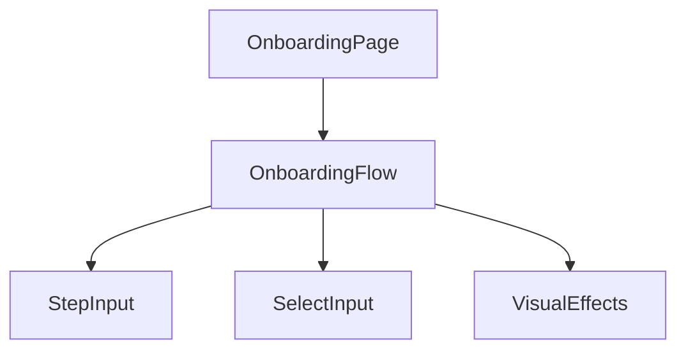

# Onboarding Feature Documentation

## Overview
The Onboarding feature is a multi-step form designed to collect user profile information and determine their role (User vs. Lawyer) immediately after sign-up.

## Architecture
- **Path**: `src/features/onboarding`
- **Entry Point**: `src/pages/OnboardingPage.jsx` -> `src/features/onboarding/index.js` -> `src/features/onboarding/components/OnboardingFlow.jsx`
- **Route**: `/signup/onboarding` (Nested under Sign Up flow)

## Data Structure
The frontend collects the following data in the `formData` state object. This is the payload that will eventually need to be sent to the backend.

### User Profile (Common)
| Field | Type | Description |
|-------|------|-------------|
| `language` | String | Preferred language (e.g., 'English', 'Spanish') |
| `fullName` | String | User's display name |
| `username` | String | Unique handle |
| `isLawyer` | Boolean | `true` if the user identifies as a lawyer |

### Lawyer Credentials (If `isLawyer` is true)
| Field | Type | Description |
|-------|------|-------------|
| `barNumber` | String | Bar Registration Number (e.g., 'BC/XXXX/YYYY') |
| `experience` | String/Number | Years of experience |
| `barCouncil` | String | Name of the Bar Council |
| `practiceArea` | String | Primary area of practice (e.g., 'Corporate Law') |

## Integration Points for Backend Developer

### 1. Submission Logic
Currently, the `finishOnboarding` function in `OnboardingFlow.jsx` (Line 73) mocks the submission with a `setTimeout` and `alert`.

**TODO:**
Replace the mock logic with an API call to your backend endpoint (e.g., `POST /api/users/onboarding`).

```javascript
// src/features/onboarding/components/OnboardingFlow.jsx

const finishOnboarding = async (role) => {
    setLoading(true);
    try {
        // TODO: Replace with actual API call
        // await api.post('/users/onboarding', formData); 
        
        // Redirect logic
        if (role === 'lawyer') {
            // navigate('/lawyer/dashboard');
        } else {
            // navigate('/dashboard');
        }
    } catch (error) {
        console.error("Onboarding failed", error);
        // Handle error (show toast, etc.)
    } finally {
        setLoading(false);
    }
};
```

### 2. Validation
- Frontend validation is minimal (checking for empty required fields).
- **Backend MUST validate:**
    - Uniqueness of `username`.
    - Validity of `barNumber` (if applicable).

### 3. Routing Context
- The user arrives here from `/signup`.
- Upon completion, they should be redirected to their respective dashboard (`/dashboard` for users, `/lawyer/dashboard` for lawyers).

## Component Graph

